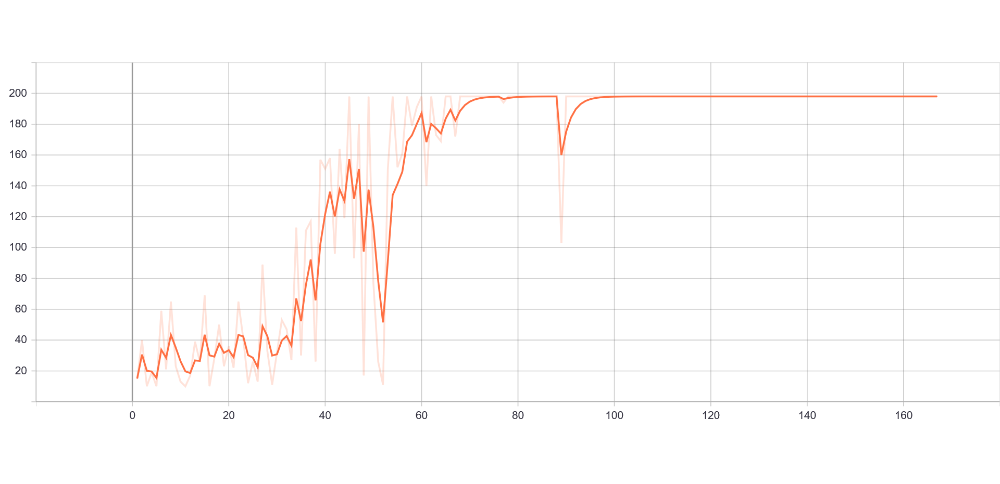
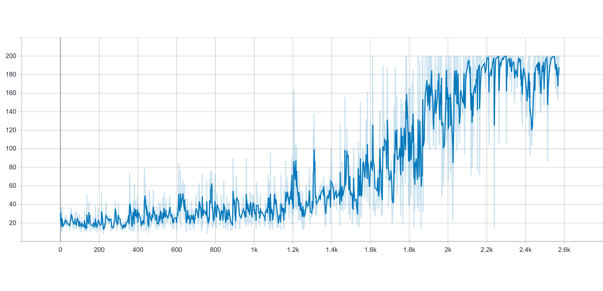

# PPO-GAIL Cartpole-v0

Example of using an inverse reinforcement learning algorithm such as [GAIL](https://arxiv.org/abs/1606.03476) to learn to imitate a [PPO](https://arxiv.org/abs/1707.06347) policy to play [Cartpole](https://gym.openai.com/envs/CartPole-v0/). In this scenario we consider the PPO policy to be the expert and GAIL has to learn to imitate it only by observing expert's trajectories. Note that both policies succed to master the game by achieving an average score of at least 199 points out of 200 over 100 episodes.

## Usage
Before start using this repository, install the required libraries in the `requirements.txt` file. You can also refere to the file `notebook.ipynb` to check the results on notebook.
```
  pip install -r requirements.txt"
```
**Train** PPO, to play Cartpole and save its weights.
```
  python PPO/main.py --train --save
```
**Evaluate** the performance of PPO (expert policy).
```
  python PPO/main.py --load --eval
```
**Collect** 100 trajectories from PPO playing Cartpole. Since we want our imitating policy to learn only on trajectories of good quality, we are going to keep only those trajectories whose total final episode reward is >= 195.
```
  python PPO/main.py --collect --min_reward 195 --n_traj 100
```
**Train** GAIL to imitate PPO.
```
  python main.py --train --save --expert_trajectories_path 'PPO/trajectories/cart_pole.pickle'
```
**Evaluate** the performance of GAIL.
```
  python main.py --load --eval
```
**Visualize** training details on Tensorboard.
```
  tensorboard --logdir=runs
```
**PPO Reward vs Training Episodes**            | 
:-------------------------:|

**GAIL Reward vs Training Episodes**            |


## Support
If you found this project interesting please support me by giving it a :star:, I would really appreciate it :grinning:

